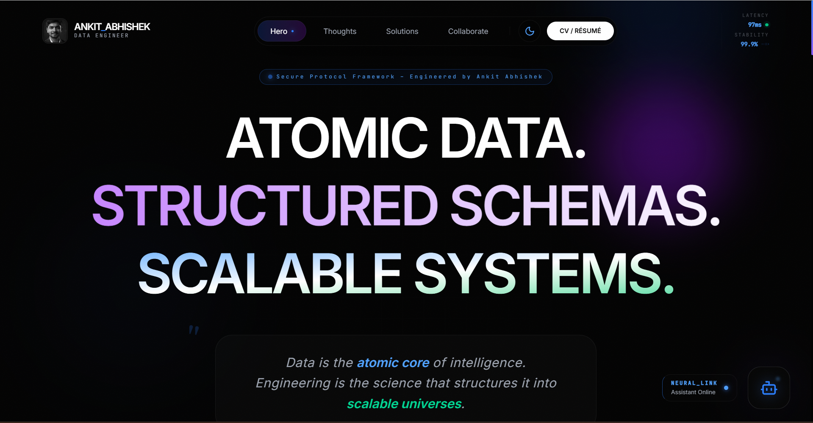

# Ankit Abhishek | Personal Portfolio

<div align="center">

</div>

## 🚀 Overview
Welcome to my official portfolio! I am **Ankit Abhishek**, a passionate **Data Engineer** and **Software Engineer** specializing in building scalable data pipelines, cloud-native platforms, and high-performance web applications.

This repository contains the source code for my personal portfolio website, designed with a premium, modern aesthetic and fluid animations to showcase my professional journey and technical projects.

## 🛠️ Tech Stack
This project is built using modern web technologies and serverless architecture:

**Frontend:**
- [React 19](https://react.dev/)
- [Vite](https://vitejs.dev/) - Build tool
- [Framer Motion](https://www.framer.com/motion/) - Animations
- [Tailwind CSS](https://tailwindcss.com/) - Styling
- [TypeScript](https://www.typescriptlang.org/)

**Backend & Infrastructure:**
- [Netlify Functions](https://docs.netlify.com/functions/overview/) - Serverless API
- [MongoDB Atlas](https://www.mongodb.com/atlas) - NoSQL Database
- [Netlify](https://www.netlify.com/) - Hosting & CI/CD

## ✨ Key Features
- **Narrative Timeline:** A chronological walkthrough of my education and career.
- **Project Showcase:** A curated list of technical projects with descriptions and visual previews.
- **Blog Management System:** A full CRUD (Create, Read, Update, Delete) blog system powered by Markdown, MongoDB, and Serverless functions.
- **Premium UI/UX:** Features glassmorphism, animated background glows, and responsive layouts.
- **Interactive Handshake:** A simulated secure connection sequence for contact initiation.
- **CMS Admin Panel:** A secure admin interface for managing blog content.

## 📂 Project Structure
```bash
AnkitAbhishekPortfolioOfficial/
├── src/
│   ├── components/     # UI Components
│   ├── pages/          # Individual page views
│   │   └── Blog.tsx    # Blog page with CMS functionality
│   ├── styles/         # Global styles
│   ├── constants/      # Static data
│   ├── hooks/          # Custom React hooks
│   └── App.tsx         # Main application logic
├── netlify/
│   └── functions/      # Serverless API endpoints
│       ├── blog.ts     # Blog CRUD handler
│       └── utils/      # Database helpers
├── public/
│   └── _redirects      # Production routing rules
├── index.html          # HTML entry point (Vite)
├── netlify.toml        # Netlify configuration (Build & Dev)
└── package.json        # Dependencies and scripts
```

## ⚙️ Getting Started

Follow these instructions to set up the project locally for development.

### Prerequisites
1.  **Node.js**: v18 or higher recommended.
2.  **MongoDB Atlas**: You need a connection string to a MongoDB cluster.
3.  **Netlify CLI** (Optional but recommended): `npm install netlify-cli -g`

### Installation

1. **Clone the repository:**
   ```bash
   git clone https://github.com/ANKIT21111/AnkitAbhishekPortfolioOfficial.git
   cd AnkitAbhishekPortfolioOfficial
   ```

2. **Install dependencies:**
   ```bash
   npm install
   ```

3. **Configure Environment Variables:**
   Create a `.env` file in the root directory and add the following:
   ```env
   MONGODB_URI=mongodb+srv://<username>:<password>@<cluster>.mongodb.net/?appName=<AppName>
   VITE_CONTACT_EMAIL=your-email@example.com
   VITE_APPS_SCRIPT_URL=your-google-script-url
   ```

### 🏃‍♂️ Running Locally

This project uses **Netlify Dev** to simulate the production environment locally. This is crucial for the API functionality (blog system) to work.

**Do not use `npm run dev` directly** if you want to test the backend/blog features.

1. **Start the full-stack development environment:**
   ```bash
   npm run dev:functions
   ```

2. **Access the Application:**
   Open your browser to: **http://localhost:8888**

   > **Important:** You must access the app via port **8888** (Netlify Dev).
   > If you access port 3000 (Vite), the API endpoints (`/api/blog`) will not work.

### Production Build

To build the project for deployment:

```bash
npm run build
```

The output will be in the `dist` folder.

## 🚀 Deployment

This project is optimized for deployment on **Netlify**.

1.  **Connect to Netlify:** Link your GitHub repository to a new site on Netlify.
2.  **Build Settings:**
    *   **Build Command:** `npm run build`
    *   **Publish Directory:** `dist`
3.  **Environment Variables:** Add your `MONGODB_URI` and other secrets in the Netlify Site Settings > Environment Variables.
4.  **Functions:** Netlify will automatically detect and deploy the functions in `netlify/functions`.

## 📬 Connect with Me
- **Email:** [ankitabhishek1005@gmail.com](mailto:ankitabhishek1005@gmail.com)
- **LinkedIn:** [Ankit Abhishek](https://www.linkedin.com/in/ankitabhishekdataengineering/)
- **GitHub:** [@ANKIT21111](https://github.com/ANKIT21111)
- **Instagram:** [@humankitabhishek](https://www.instagram.com/humankitabhishek/)

---
<p align="center">Made with ❤️ by Ankit Abhishek</p>
