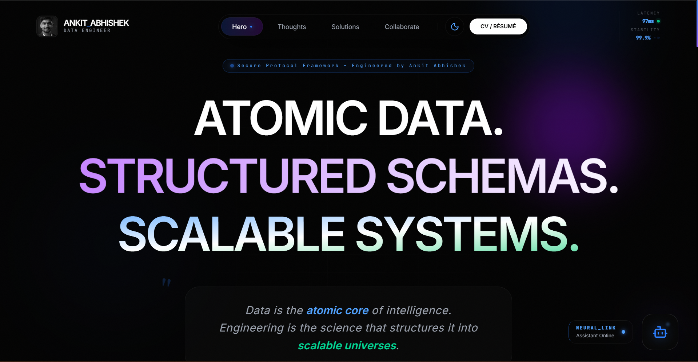

# Ankit Abhishek | Personal Portfolio

<div align="center">
  
  <br/>
  <br/>
  
  [](https://reactjs.org/)
  [](https://www.typescriptlang.org/)
  [](https://vitejs.dev/)
  [](https://tailwindcss.com/)
  [](https://www.netlify.com/)
  [](https://www.mongodb.com/)
</div>

## 🚀 Overview

Welcome to the official source code for **Ankit Abhishek's Portfolio**. This project is a modern, high-performance personal brand platform built with a **serverless architecture** and premium design aesthetics, now supercharged with **AI-integrated features**.

It goes beyond a static site, featuring an interactive **Portfolio Bot** assistant, an **AI-powered Project Architect** explainer, a playful **Portfolio Roast** engine, and a unique **Collaborate** experience—all wrapped in a glassmorphism-inspired design.

## 🆕 What's New (March 2026)

- **🧠 AI Project Architect**: Every project in the Solutions gallery now features an **"AI Explain"** mode, providing deep architectural insights, tech stack reasoning, and problem-solving logic.
- **🔥 Roast My Portfolio**: An interactive AI engagement engine on the Collaborate page that provides humorous, "roast-style" feedback on the portfolio.
- **🌍 Live Visitor Analytics**: Real-time visualization of global site traffic and visitor presence on a dynamic map within the Solutions page.
- **🎨 Visual Refresh**: Updated site branding with a new custom favicon and UX refinements for **Portfolio Bot v2.0**.

## ✨ Key Features & Recent Updates

- **🎨 Premium UI/UX:** Responsive glassmorphism design powered by **Tailwind CSS 4** and fluid **Framer Motion 12** animations. Fully optimized for Ultra-wide, Desktop, and Mobile displays.
- **🧠 AI Project Architect:** (NEW) Deep dive into project architecture, technical stacks, and problem-solving logic via an interactive AI-driven explanation overlay.
- **🔥 Portfolio Roast:** (NEW) A playful, engagement-focused AI agent that provides humorous feedback on the portfolio, increasing user interaction.
- **🌍 Live Visitor Pulse:** (NEW) Real-time visualization of global site traffic and visitor locations via an interactive world map integration.
- **🛠️ Engineering Ecosystem:** Interactive, categorized visualization of technical capabilities including a dynamic **Professional Stack** matrix for Infrastructure, Processing, and Storage.
- **🤖 Portfolio Bot v2.0:** An enhanced integrated technical assistant that guides users through the portfolio with refined design and interaction logic.
- **📝 "Thoughts" CMS:** A performance-optimized full-stack blog engine with **Deep Linking**, Markdown support, and a technical image insertion workflow.
- **🔐 Secure Operations:** **OTP (One-Time Password)** verification for administrative actions (Create/Update/Delete), ensuring secure data management.
- **⚙️ Temporal Matrix v2.0:** An interactive 3D narrative journey through professional milestones and technical evolution.

## 🛠️ Tech Stack

| Category | Technologies |
|----------|--------------|
| **Frontend** | React 19, TypeScript, Tailwind CSS 4, Framer Motion 12, React Router 7 |
| **Build Tool** | Vite 6 |
| **Backend** | Netlify Functions (Node.js Serverless) |
| **Security** | MongoDB-backed OTP Verification |
| **Database** | MongoDB Atlas |
| **Deployment** | Netlify (CI/CD) |

## 📂 Project Structure

```bash
 AnkitAbhishekPortfolioOfficial/
├── netlify/functions/  # Serverless backend logic (API, OTP, Blog CRUD)
├── src/
│   ├── components/
│   │   ├── ui/         # PortfolioBot, OptimizedImage, etc.
│   │   └── layout/     # Navbar, Footer, etc.
│   ├── pages/
│   │   ├── Hero.tsx         # Modern landing experience
│   │   ├── Thoughts.tsx     # Blog CMS with Markdown & Images
│   │   ├── Solutions.tsx    # Professional Project Showcase
│   │   └── Collaborate.tsx  # Interactive Contact & Handshake
│   ├── constants/      # Project data & Timeline configuration
│   ├── hooks/          # Custom React hooks
│   └── styles/         # Global & Tailwind CSS
├── public/             # Static assets (Resume, Icons)
└── netlify.toml        # Netlify build & dev configuration
```

## ⚙️ Getting Started (Local Development)

Follow these steps to run the complete full-stack application locally.

### 1. Prerequisites
- **Node.js** (v18+)
- **MongoDB Atlas** Cluster (You need a connection string)
- **Netlify CLI** (Global install recommended: `npm i -g netlify-cli`)

### 2. Installation

```bash
# Clone the repository
git clone https://github.com/ANKIT21111/AnkitAbhishekPortfolioOfficial.git
cd AnkitAbhishekPortfolioOfficial

# Install dependencies
npm install
```

### 3. Environment Setup
Create a `.env` file in the root directory linked to your MongoDB cluster and Google Apps Script:

```env
MONGODB_URI=mongodb+srv://<user>:<password>@cluster.mongodb.net/?appName=Portfolio
VITE_CONTACT_EMAIL=your-email@example.com
VITE_APPS_SCRIPT_URL=your-google-script-url
```

### 4. Running the App
We use **Netlify Dev** to simulate the production serverless environment locally.

**Option 1: Split Terminal (Recommended for Debugging)**
Run frontend and backend in separate terminals for better log visibility.

*Terminal 1 (Backend):*
```bash
npm run serve:functions
# Runs Netlify Functions on http://localhost:9999
```

*Terminal 2 (Frontend):*
```bash
npm run dev
# Runs Vite Frontend on http://localhost:5173 (proxies API requests to backend)
```

**Option 2: All-in-One**
```bash
npm run dev:functions
# Runs everything at http://localhost:8888
```

## ☁️ Deployment Guide

This project is optimized for **Netlify**.

1.  **Repo Config:** Push your code to GitHub.
2.  **New Site:** In Netlify, "Account" -> "Add new site" -> "Import an existing project".
3.  **Build Settings:**
    -   **Build Command:** `npm run build`
    -   **Publish Directory:** `dist`
    -   **Functions Directory:** `netlify/functions` (Auto-detected)
4.  **Environment Variables:**
    -   Go to **Site Settings > Environment Variables**.
    -   Add `MONGODB_URI`, `VITE_CONTACT_EMAIL`, `VITE_APPS_SCRIPT_URL`, etc.
5.  **Deploy:** Click "Deploy Site".

### 🚑 Troubleshooting
-   **MongoDB Error?** Ensure your MongoDB Atlas **Network Access** whitelist allows access from anywhere (`0.0.0.0/0`) as Netlify IPs change.
-   **White Screen?** Check the browser console for errors. Ensure your environment variables are set correctly in Netlify.

## 📬 Connect with Me

- **LinkedIn:** [Ankit Abhishek](https://www.linkedin.com/in/ankitabhishekdataengineering/)
- **Email:** [ankitabhishek1005@gmail.com](mailto:ankitabhishek1005@gmail.com)
- **GitHub:** [@ANKIT21111](https://github.com/ANKIT21111)
- **Instagram:** [@humankitabhishek](https://www.instagram.com/humankitabhishek/)

---
<div align="center">
  <small>Designed & Built by Ankit Abhishek</small>
</div>
