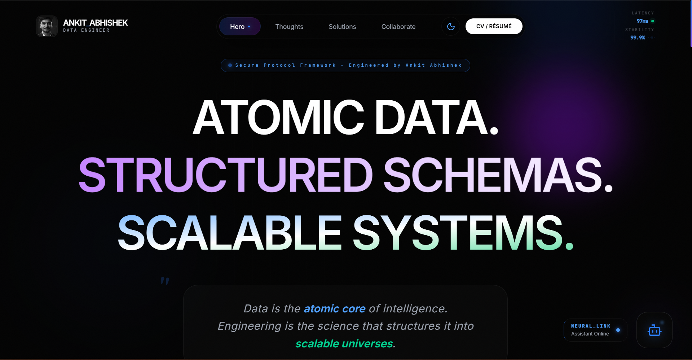

# Ankit Abhishek | Data Engineer & Software Engineer

<div align="center">
  
  <br/>
  <br/>

  [](https://reactjs.org/)
  [](https://www.typescriptlang.org/)
  [](https://vitejs.dev/)
  [](https://tailwindcss.com/)
  [](https://www.framer.com/motion/)
  [](https://www.netlify.com/)
  [](https://www.mongodb.com/)
</div>

---

## 🚀 Overview

This repository hosts the official source code for **Ankit Abhishek's Portfolio** — a high-performance, production-grade personal brand platform. Built with a **serverless-first architecture** and premium design aesthetics, this project demonstrates advanced engineering patterns across **Full-Stack Development**, **Cloud Serverless**, **Security**, and **AI Integration**.

More than a static showcase, this platform implements features typically found in production SaaS products — including a **knowledge-base AI Portfolio Bot**, a **Custom Markdown CMS with OTP-gated admin**, a **dynamic Open Graph Edge Function**, and a **real-time blog subscription ecosystem**.

---

## 🛡️ Core Engineering Achievements

### 1. Advanced Security & Abuse Protection
- **OTP-Gated Admin:** A 6-digit OTP system (stored in MongoDB with a 5-minute TTL) protects all blog mutations (create/update/delete). Each OTP is single-use and delivered via Gmail through a Google Apps Script microservice.
- **JWT Session Management:** `auth.ts` issues and validates JWT tokens for admin actions.
- **IP-Based Rate Limiting:** Custom rate-limiting middleware stored in MongoDB enforces per-endpoint limits (100 GET / 10 write requests per 15-minute window).
- **Input Sanitization:** Validation utilities in `netlify/functions/utils/validation.ts` guard all API inputs against injection attacks.
- **Client-Side Content Protection:** Right-click context menu, keyboard shortcuts (Ctrl+C, Ctrl+U, Ctrl+S, F12, DevTools), and image drag-and-drop are disabled globally.

### 2. High-Performance CMS & Content Delivery
- **Thoughts Markdown Engine:** A full blog CMS at `/thoughts` powered by `react-markdown`, featuring Table of Contents generation, pagination, deep-linking, and automated blog-post email notifications to subscribers.
- **Subscription Ecosystem:** Subscribers receive welcome emails and per-post notifications via a Google Apps Script email microservice. One-click unsubscription via signed tokens is handled by `unsubscribe.ts`.
- **Dynamic OG Meta Tags:** A Netlify Edge Function (`og-meta.ts`) intercepts social media bot crawlers on `/thoughts?id=*` to inject per-post Open Graph and Twitter Card meta tags, enabling rich link previews.

### 3. Premium Progressive Web Experience
- **Custom Cursor System:** A three-layer spring-animated cursor (outer ring, inner dot, hover glow ring, ambient glow) built with Framer Motion springs — only activated on desktop with fine pointer input.
- **Scroll Progress Bar:** A fixed gradient progress indicator tied to Framer Motion's `useScroll`.
- **Page Transitions:** `AnimatePresence`-based fade+slide transitions between all routes.
- **Reduced Motion Support:** All animations degrade gracefully when `prefers-reduced-motion` is active.
- **PWA Ready:** Manifest and offline capabilities via `public/` static assets.
- **Accessibility:** Skip-to-content link, semantic HTML, proper heading hierarchy, and ARIA labels throughout.

### 4. AI-Native Architecture
- **Portfolio Bot:** A floating AI chatbot (`PortfolioBot.tsx`) backed by a curated knowledge base covering resume, projects, tech stack, interview preparation, and social links. It features multi-turn conversation, typing indicators, and a spring-animated drag handle.
- **AI Project Explainer:** The `/solutions` page includes per-project architecture explainers and "AI Roast" engagement tools that demonstrate creative LLM integration patterns.

### 5. Performance Engineering
- **Code Splitting:** Manual Rollup chunks separate `vendor-react`, `vendor-framer`, and `vendor-icons` bundles.
- **Dual Compression:** Both gzip and Brotli variants generated at build time via `vite-plugin-compression`.
- **Lazy Loading:** All page components load on demand via `React.lazy()` + `Suspense`.
- **Optimized Images:** `OptimizedImage.tsx` provides shimmer placeholders with blur-in fade reveal using native lazy loading.
- **esbuild Minification:** `drop_console` and `drop_debugger` strip development artifacts in production.

---

## 🛠️ Technical Stack

| Category | Technologies |
|----------|--------------|
| **Frontend** | React 19, TypeScript 5.8, Tailwind CSS v4, Framer Motion 12, React Router v7, Lucide React |
| **Backend** | Netlify Functions (Node.js serverless), Netlify Edge Functions (Deno runtime) |
| **Database** | MongoDB Atlas (`posts`, `otps`, `subscribers`, `rateLimits` collections) |
| **Email** | Google Apps Script (Gmail microservice), rich HTML email templates |
| **Security** | OTP + JWT auth, IP rate limiting, input validation/sanitization |
| **Build Tooling** | Vite 6, esbuild, PostCSS, vite-plugin-compression, @tailwindcss/vite |
| **Testing** | Vitest 4, jsdom, @testing-library/jest-dom |
| **CI/CD** | GitHub Actions (CI + Deploy), Netlify CLI, OWASP Dependency-Check |

---

## 📂 Architecture & Project Structure

```
AnkitAbhishekPortfolioOfficial/
├── .github/
│   └── workflows/
│       ├── ci.yml              # Lint → type-check → OWASP → audit → test → build → smoke-test
│       └── deploy.yml          # Build → Netlify deploy (prod on main, preview on PRs)
├── google-apps-script/
│   └── Code.gs                 # Gmail email microservice
├── netlify/
│   ├── edge-functions/
│   │   └── og-meta.ts          # Dynamic OG meta injection for social crawlers
│   └── functions/
│       ├── utils/
│       │   ├── db.ts           # MongoDB connection pooling
│       │   ├── emailTemplates.ts # HTML email templates
│       │   ├── rateLimit.ts    # IP-based rate limiting
│       │   └── validation.ts   # Input sanitization
│       ├── auth.ts             # JWT session management
│       ├── blog.ts             # Blog CRUD (OTP-protected writes)
│       ├── collaborate.ts      # Contact form handler
│       ├── otp.ts              # OTP generation & delivery
│       ├── subscribe.ts        # Email subscription
│       └── unsubscribe.ts      # One-click unsubscribe
├── public/                     # Static assets (PWA manifest, favicon, resume, icons)
├── src/
│   ├── assets/                 # Images and logos
│   ├── components/
│   │   ├── layout/
│   │   │   ├── Navbar.tsx      # Responsive sticky navbar
│   │   │   └── Footer.tsx      # Footer with social links
│   │   ├── ui/
│   │   │   ├── PortfolioBot.tsx     # AI portfolio chatbot
│   │   │   ├── CookieConsent.tsx    # GDPR/CCPA consent toast
│   │   │   ├── OptimizedImage.tsx   # Lazy image with shimmer placeholder
│   │   │   └── ThemeToggle.tsx      # Three-state theme toggle
│   │   └── SkipLink.tsx             # Accessibility skip link
│   ├── constants/
│   │   └── constants.ts        # TIMELINE_DATA, PROJECTS_DATA, HERO_STATS
│   ├── context/
│   │   └── ThemeContext.tsx    # light/dark/system theme provider
│   ├── hooks/
│   │   ├── useDevice.ts        # Viewport, input type, cursor capability
│   │   └── useReducedMotion.ts # OS reduced-motion preference
│   ├── pages/
│   │   ├── Hero.tsx            # Landing: hero, stats, career timeline
│   │   ├── Thoughts.tsx        # Blog CMS with Markdown & pagination
│   │   ├── Solutions.tsx       # Project showcase with AI explainer
│   │   ├── Collaborate.tsx     # Contact form & AI roast engine
│   │   ├── PrivacyPolicy.tsx   # Privacy Policy
│   │   ├── TermsOfService.tsx  # Terms of Service
│   │   └── Unsubscribe.tsx     # Email unsubscribe handler
│   ├── styles/
│   │   └── globals.css         # Tailwind v4 config + design tokens + animations
│   ├── types/
│   │   └── types.ts            # TypeScript interfaces
│   ├── utils/
│   │   └── themeUtils.ts       # System theme detection & OS listener
│   ├── App.tsx                 # Router, cursor system, scroll progress, guards
│   └── index.tsx               # Entry point — ThemeProvider wraps App
├── index.html                  # SPA shell with full SEO/OG meta
├── netlify.toml                # Build config, redirects, edge function bindings
├── package.json
├── vite.config.ts              # Plugins, proxy, manual chunks, compression
└── vitest.config.ts            # Vitest with jsdom environment
```

---

## ⚙️ Getting Started (Local Development)

### Prerequisites
- **Node.js** v18+
- **MongoDB Atlas** account (free tier works)
- **Netlify CLI** — `npm i -g netlify-cli` *(required for running functions locally)*

### Installation

```bash
git clone https://github.com/ANKIT21111/AnkitAbhishekPortfolioOfficial.git
cd AnkitAbhishekPortfolioOfficial
npm install
# If peer dependency conflicts arise:
# npm install --legacy-peer-deps
```

### Configuration

Create a `.env` file in the project root:

```env
MONGODB_URI=mongodb+srv://<user>:<password>@<cluster>.mongodb.net/?appName=<AppName>
VITE_CONTACT_EMAIL=your-email@example.com
CONTACT_EMAIL=your-email@example.com
APPS_SCRIPT_URL=https://script.google.com/macros/s/<script-id>/exec
JWT_SECRET=your-secure-random-256-bit-secret
```

### Running Locally

```bash
# Recommended — starts Vite dev server + Netlify Functions together
npm run dev:functions
# Frontend:  http://localhost:3000
# Functions: http://localhost:9999/.netlify/functions/*
# Unified:   http://localhost:8888

# Frontend only (no serverless functions)
npm run dev

# Run tests
npm test

# Type-check without building
npm run type-check

# Lint
npm run lint
```

---

## 🚀 Deployment

The platform is deployed to **Netlify** with automated CI/CD via **GitHub Actions**.

### CI Pipeline (`ci.yml`)
Runs on every push and PR to `main`:
1. Install dependencies
2. OWASP Dependency-Check (vulnerability scan, fails on CVSS ≥ 9)
3. `npm audit --audit-level=critical`
4. ESLint
5. TypeScript type-check
6. Vitest unit tests
7. Production build
8. Smoke test (serve `dist/` and curl health check)

### Deploy Pipeline (`deploy.yml`)
- **Push to `main`** → production deploy (`--prod`)
- **Pull Request** → preview/draft deploy URL
- Requires GitHub Secrets: `NETLIFY_AUTH_TOKEN`, `NETLIFY_SITE_ID`

### Netlify Configuration (`netlify.toml`)
- Build command: `npm run build`
- Publish directory: `dist/`
- Functions directory: `netlify/functions/`
- SPA fallback redirect: `/* → /index.html`
- API proxy: `/api/*` → `/.netlify/functions/:splat`
- Edge function: `og-meta.ts` bound to `/thoughts`

---

## 🌐 Routes & API Endpoints

| Frontend Route | Description |
|----------------|-------------|
| `/` | Hero / Landing page |
| `/thoughts` | Blog CMS |
| `/solutions` | Project showcase |
| `/collaborate` | Contact & AI tools |
| `/privacy` | Privacy Policy |
| `/terms` | Terms of Service |
| `/unsubscribe` | Email unsubscribe |

| API Endpoint | Methods | Description |
|--------------|---------|-------------|
| `/api/blog` | GET, POST, PUT, DELETE | Blog post CRUD (writes require OTP) |
| `/api/otp` | POST | Request an admin OTP |
| `/api/auth` | POST | JWT session management |
| `/api/subscribe` | POST | Subscribe to blog updates |
| `/api/unsubscribe` | POST | Unsubscribe from blog updates |
| `/api/collaborate` | POST | Submit a contact/collaborate request |

---

## 📬 Connect

| Platform | Link |
|----------|------|
| **LinkedIn** | [Ankit Abhishek](https://www.linkedin.com/in/ankitabhishekdataengineering/) |
| **GitHub** | [@ANKIT21111](https://github.com/ANKIT21111) |
| **Portfolio** | [ankitabhishek.com](https://ankitabhishek.com) |
| **Email** | [ankitabhishek1005@gmail.com](mailto:ankitabhishek1005@gmail.com) |
| **Instagram** | [@humankitabhishek](https://www.instagram.com/humankitabhishek/) |

---

<div align="center">
  <small>Architecture & Engineering by <b>Ankit Abhishek</b> &copy; 2026</small>
</div>
